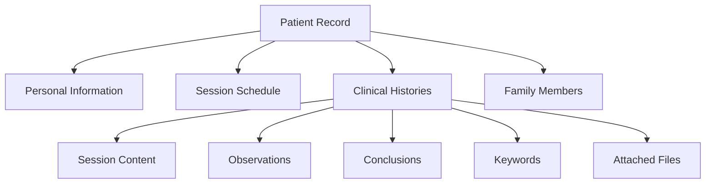

Clinical histories are detailed records of patient therapy sessions, including session content, observations, and conclusions. This guide explains how to create and manage these important clinical documents.

## Overview

Clinical history records provide:

- Session-by-session documentation
- Treatment progress tracking
- Professional observations and conclusions
- Attachment support for session-related files
- Searchable keywords for easy retrieval

<Info>
  Each clinical history record is uniquely identified by a clinical history code, making it easy to search and reference specific sessions.
</Info>

## Understanding Clinical History Structure

A clinical history record consists of several components:

<CardGroup cols={2}>
  <Card title="Session Information" icon="calendar">
    - Clinical history code
    - Session date
    - Psychologist name
  </Card>
  
  <Card title="Session Content" icon="file-lines">
    - Main content/notes
    - Observations
    - Conclusions
  </Card>
  
  <Card title="Keywords" icon="tags">
    - Searchable tags
    - Topic identifiers
    - Quick reference labels
  </Card>
  
  <Card title="Attachments" icon="paperclip">
    - Supporting documents
    - Test results
    - Related files
  </Card>
</CardGroup>

## Clinical History Data Model

Understanding the structure helps you use the system effectively:

<CodeGroup>
```java Clinical History Model
// From ClinicalHistory.java:20-53
@Entity
public class ClinicalHistory {
    
    @Id
    @GeneratedValue(strategy = GenerationType.IDENTITY)
    private Long clinicHistoryId;
    
    // User-facing identifier for search
    private String clinicHistoryCode;
    
    private Date sessionDate;
    
    @Column(length = 4000)
    private String content;
    
    @Column(length = 4000)
    private String observation;
    
    @Column(length = 4000)
    private String conclusion;
    
    private List<String> keyWords;
    
    @OneToMany(mappedBy = "clinicalHistory")
    private List<ClinicalHistoryFile> files;
    
    private String psychologistName;
}
```
</CodeGroup>

<Note>
  Content, observation, and conclusion fields support up to 4000 characters each, providing ample space for detailed session documentation.
</Note>

## Creating a Clinical History Record

While the full clinical history creation interface is under development, here's the workflow:

<Steps>
  <Step title="Access Clinical History Function">
    Click **"Cargar Sesión"** (Load Session) in the main menu.
    
    This opens the clinical history creation interface.
  </Step>

  <Step title="Enter Session Metadata">
    Fill in the basic session information:
    
    - **Clinical History Code**: Unique identifier for this session (e.g., "CH-2024-001")
    - **Session Date**: Date when the session took place
    - **Psychologist Name**: Name of the treating professional
    
    <Tip>
      Use a consistent naming convention for clinical history codes to make searching easier (e.g., CH-YYYY-NNN for chronological numbering).
    </Tip>
  </Step>

  <Step title="Document Session Content">
    Record what happened during the session:
    
    - **Content**: Main session notes
      - Topics discussed
      - Patient's mood and presentation
      - Interventions used
      - Patient responses
      - Homework or action items
    
    The content field supports detailed, structured notes with up to 4000 characters.
  </Step>

  <Step title="Add Professional Observations">
    In the **Observations** field, record:
    
    - Clinical observations
    - Patient's progress
    - Changes since last session
    - Therapeutic relationship notes
    - Risk factors or concerns
    
    This section is for professional analysis separate from the session narrative.
  </Step>

  <Step title="Write Conclusions">
    Document your professional conclusions:
    
    - Treatment effectiveness
    - Next steps
    - Plan adjustments
    - Prognosis updates
    - Recommendations
  </Step>

  <Step title="Add Keywords">
    Tag the session with relevant keywords for easy searching:
    
    - Presenting problems (e.g., "anxiety", "depression")
    - Techniques used (e.g., "CBT", "mindfulness")
    - Themes (e.g., "family", "work stress")
    - Session type (e.g., "intake", "follow-up", "crisis")
    
    <Info>
      Keywords are stored as a list and can be used for filtering and searching clinical histories later.
    </Info>
  </Step>

  <Step title="Attach Supporting Files">
    If you have related documents:
    
    - Assessment results
    - Test scores
    - Consent forms
    - Referral letters
    
    Attach them to the clinical history record for complete documentation.
  </Step>

  <Step title="Save the Record">
    Click **Save** to store the clinical history in the database.
    
    The record is now associated with the patient and searchable by clinical history code.
  </Step>
</Steps>

## Searching Clinical Histories

To find specific clinical history records:

<Steps>
  <Step title="Open Search Function">
    Click **"Buscar Historia Clinica"** (Search Clinical History) in the main menu.
  </Step>

  <Step title="Enter Search Criteria">
    You can search by:
    
    - Clinical history code
    - Session date
    - Patient name
    - Keywords
    - Psychologist name
  </Step>

  <Step title="Review Results">
    Browse through matching clinical histories and select the one you need to view or edit.
  </Step>
</Steps>

<Note>
  The search functionality is designed to work with the `clinicHistoryCode` field, which is the user-facing identifier rather than the internal database ID.
</Note>

## Managing Clinical History Files

Clinical histories can include attached files:

### File Types Supported

<Tabs>
  <Tab title="Documents">
    - PDF reports
    - Assessment forms
    - Consent documents
    - Treatment plans
  </Tab>
  
  <Tab title="Images">
    - Test result scans
    - Diagrams or drawings
    - Signed forms
  </Tab>
  
  <Tab title="Other">
    - Audio recordings (where permitted)
    - Specialized assessment files
  </Tab>
</Tabs>

### File Management

The `ClinicalHistoryFile` entity manages attachments:

```java
// Clinical history files are linked to their parent record
@OneToMany(mappedBy = "clinicalHistory")
private List<ClinicalHistoryFile> files;
```

Each file maintains:
- Reference to parent clinical history
- File name and location
- File type and metadata

## Best Practices for Clinical Documentation

<AccordionGroup>
  <Accordion title="Be Detailed but Concise">
    Write clear, professional notes that capture essential information without unnecessary detail.
    
    **Do**:
    - Use professional language
    - Focus on relevant observations
    - Include specific examples
    
    **Don't**:
    - Include irrelevant personal opinions
    - Use jargon without explanation
    - Leave vague, unclear notes
  </Accordion>
  
  <Accordion title="Document Immediately After Sessions">
    Complete clinical histories as soon as possible after sessions while details are fresh.
    
    **Benefits**:
    - More accurate recall
    - Better continuity of care
    - Improved treatment planning
  </Accordion>
  
  <Accordion title="Use Consistent Keywords">
    Develop a standard set of keywords for your practice.
    
    **Example keyword categories**:
    - Diagnoses: "GAD", "MDD", "PTSD"
    - Techniques: "CBT", "DBT", "EMDR"
    - Themes: "relationships", "trauma", "grief"
    - Status: "progress", "plateau", "crisis"
  </Accordion>
  
  <Accordion title="Separate Facts from Interpretations">
    Distinguish between objective observations and professional interpretations.
    
    **Structure**:
    - **Content**: What happened (facts)
    - **Observations**: What you noticed (clinical observations)
    - **Conclusions**: What it means (professional analysis)
  </Accordion>
  
  <Accordion title="Review Previous Sessions">
    Before creating a new clinical history, review recent sessions to:
    
    - Track progress
    - Identify patterns
    - Ensure continuity
    - Reference previous interventions
  </Accordion>
</AccordionGroup>

## Clinical History Code Conventions

Establishing a consistent coding system helps with organization:

<CodeGroup>
```text Chronological Format
CH-YYYY-NNN

Examples:
CH-2024-001 (First session of 2024)
CH-2024-042 (Forty-second session of 2024)
```

```text Patient-Based Format
CH-PatientID-SessionNum

Examples:
CH-1234-001 (First session for patient 1234)
CH-1234-012 (Twelfth session for patient 1234)
```

```text Date-Based Format
CH-YYYYMMDD-PatientID

Examples:
CH-20240315-1234 (March 15, 2024, patient 1234)
CH-20240322-1234 (March 22, 2024, patient 1234)
```
</CodeGroup>

<Tip>
  Choose a format that fits your workflow and stick with it consistently across all clinical histories.
</Tip>

## Data Privacy and Security

Clinical histories contain sensitive information:

<Warning>
  **Important Security Considerations**:
  
  - All clinical data is stored in the local database
  - Access should be restricted to authorized users only
  - Regular backups are essential
  - Comply with local healthcare privacy regulations (HIPAA, GDPR, etc.)
  - Do not share clinical history codes or patient information unnecessarily
</Warning>

## Integration with Patient Records

Clinical histories are part of the comprehensive patient record:



## Troubleshooting

<AccordionGroup>
  <Accordion title="Clinical history not saving">
    **Check**:
    - Clinical history code is unique
    - Session date is valid
    - Content fields don't exceed 4000 characters
    - Database connection is active
    
    **Solution**: Verify all required fields and check for character limit violations.
  </Accordion>
  
  <Accordion title="Cannot find clinical history">
    **Check**:
    - Clinical history code is entered correctly
    - Search criteria matches existing records
    - Record was successfully saved
    
    **Solution**: Try searching with different criteria or browse all records.
  </Accordion>
  
  <Accordion title="File attachments not working">
    **Check**:
    - File path is accessible
    - File permissions allow reading
    - File size is within limits
    
    **Solution**: Verify file system access and check console for error messages.
  </Accordion>
</AccordionGroup>

## Next Steps

<CardGroup cols={2}>
  <Card title="Patient Management" icon="user" href="/guide/patient-management">
    Learn how to manage patient records and information
  </Card>
  
  <Card title="Sessions" icon="calendar-days" href="/guide/sessions">
    Manage patient therapy session schedules
  </Card>
</CardGroup>