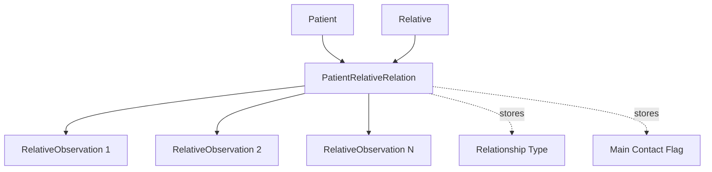

The Patient Manager application allows you to track family members and relatives for each patient. This feature helps maintain comprehensive patient records including emergency contacts, family dynamics, and support systems.

## Overview

Patient relatives management provides:

- Complete family member information
- Relationship tracking
- Emergency contact designation
- Family member observations and notes
- Quick access to relative details from patient records

<Info>
  Family members can serve as emergency contacts, support persons, or be tracked for understanding family dynamics that impact treatment.
</Info>

## Understanding the Relatives System

The relatives system uses three interconnected models:

<CardGroup cols={3}>
  <Card title="Relative" icon="user">
    Basic information about the family member:
    - Name and demographics
    - Contact information
    - Personal details
  </Card>
  
  <Card title="Relation" icon="link">
    Connection between patient and relative:
    - Relationship type
    - Main contact status
    - Shared observations
  </Card>
  
  <Card title="Observations" icon="note-sticky">
    Time-stamped notes about the relative:
    - Date-specific observations
    - Interaction notes
    - Updates over time
  </Card>
</CardGroup>

## Data Model Structure

<CodeGroup>
```java Patient-Relative Relationship
// The relationship between patient and relative includes:
- Patient reference
- Relative reference
- Relationship type (Madre, Padre, Hermana, etc.)
- List of observations
- Main contact flag

public PatientRelativeRelation(
    Patient patient,
    Relative newRelative,
    String relation,
    List<RelativeObservation> observations,
    Boolean isMainContact
)
```

```java Relative Observation
// Time-stamped notes about the relative:
public RelativeObservation(
    PatientRelativeRelation relation,
    Date observationDate,
    String observationContent
)
```
</CodeGroup>

## Adding a Family Member

To add a new relative to a patient's record:

<Steps>
  <Step title="Access Patient Record">
    1. Click **Ver Pacientes** (View Patients) in the main menu
    2. Select the patient from the table
    3. Click **Ver** (View) to open the patient details
    
    The patient detail view shows the **Familiares** (Family Members) section on the right side.
  </Step>

  <Step title="Open Add Relative Form">
    Click the **Add** button (with plus icon) in the Family Members section.
    
    This opens a new window with the "Add Relative" form.
  </Step>

  <Step title="Enter Personal Information">
    Complete the **Personal Data** section:
    
    - **Name** (Nombre): Relative's first name
    - **Last Name** (Apellido): Relative's last name
    - **Birth Date** (Fecha Nac.): Select from date picker
    - **Gender** (Género): Select from dropdown
      - Masculino, Femenino, Gay, Lesbiana, Trans F, Trans M, No Binario, Otro
    - **Address** (Dirección): Street address
    - **City** (Ciudad): City of residence
    - **Country** (País): Select from dropdown
    - **Relationship** (Relación): Select from dropdown
      - Abuela, Abuelo, Amiga, Amigo
      - Hermana, Hermano
      - Madre, Padre
      - Nieta, Nieto
      - Prima, Primo
      - Tía, Tío
  </Step>

  <Step title="Add Contact Information">
    Fill in the **Contact Data** section:
    
    - **Phone 1** (Tel. 1): Primary phone number
    - **Phone 2** (Tel. 2): Secondary phone number
    - **Email**: Email address
    - **Main Contact** (Contacto principal): Check if this is the primary emergency contact
    
    <Tip>
      Mark at least one family member as "Main Contact" for emergency situations.
    </Tip>
  </Step>

  <Step title="Add Initial Observations">
    In the **Initial Observations** section, record:
    
    - Relationship to patient
    - Contact preferences
    - Availability
    - Role in patient's care
    - Any concerns or notes
    - Relevant family dynamics
    
    These observations are automatically dated with the current date.
  </Step>

  <Step title="Save the Relative">
    Click **Guardar** (Save) to create the relative record.
    
    The system:
    1. Creates the Relative entity
    2. Creates the PatientRelativeRelation linking them
    3. Creates the initial RelativeObservation
    4. Updates the patient's family member list
    5. Closes the form and refreshes the patient view
    
    Or click **Limpiar** (Clear) to reset all fields.
  </Step>
</Steps>

## Viewing Relative Details

To view complete information about a family member:

<Steps>
  <Step title="Navigate to Patient Record">
    Open the patient's detail view showing the family members list.
  </Step>

  <Step title="Open Relative Details">
    **Double-click** on any relative in the family members list.
    
    This opens a new window (`RelativeDataFrame`) with complete relative information.
  </Step>

  <Step title="Review Information">
    The relative detail window shows:
    - Complete personal information
    - Contact details
    - Relationship to patient
    - Main contact status
    - All observations (with dates)
  </Step>
</Steps>

<Note>
  The double-click interaction is defined in PatientDataPane.java:58-71 and provides quick access to relative details.
</Note>

## Relationship Types

The application supports various family relationships:

<Tabs>
  <Tab title="Parents & Grandparents">
    - **Madre** (Mother)
    - **Padre** (Father)
    - **Abuela** (Grandmother)
    - **Abuelo** (Grandfather)
  </Tab>
  
  <Tab title="Siblings & Children">
    - **Hermana** (Sister)
    - **Hermano** (Brother)
    - **Nieta** (Granddaughter)
    - **Nieto** (Grandson)
  </Tab>
  
  <Tab title="Extended Family">
    - **Prima** (Female Cousin)
    - **Primo** (Male Cousin)
    - **Tía** (Aunt)
    - **Tío** (Uncle)
  </Tab>
  
  <Tab title="Non-Family">
    - **Amiga** (Female Friend)
    - **Amigo** (Male Friend)
  </Tab>
</Tabs>

## Main Contact Designation

The "Main Contact" (Contacto principal) checkbox designates emergency contacts:

### When to Mark as Main Contact

<Accordion title="Primary Emergency Contact">
  **Mark as main contact when**:
  - This person should be called in emergencies
  - They are the primary support person
  - They have authority to make decisions (if applicable)
  - They are most involved in the patient's care
  
  **Benefits**:
  - Quick identification of who to contact
  - Clear documentation of support system
  - Easy access to emergency contact info
</Accordion>

<Accordion title="Multiple Main Contacts">
  You can designate multiple relatives as main contacts:
  
  **Example scenario**:
  - Mother: Main contact (primary)
  - Father: Main contact (secondary)
  - Sister: Not main contact (but available)
  
  This provides backup contacts if the primary is unavailable.
</Accordion>

## Managing Relative Observations

Observations track interactions and updates about family members:

### Creating Observations

When you add a relative, the initial observation is automatically created:

```java
// From RelativeAddForm.java:560-564
Date currentDate = Date.from(
    LocalDate.now(ZoneId.of("America/Argentina/Buenos_Aires"))
    .atStartOfDay(ZoneId.of("America/Argentina/Buenos_Aires"))
    .toInstant()
);

RelativeObservation newObservation = new RelativeObservation(
    patientRelativeRelation,
    currentDate,
    observationsData
);
```

### Observation Best Practices

<AccordionGroup>
  <Accordion title="Document First Contact">
    Initial observation should include:
    - How you met/contacted the relative
    - Their role in patient's life
    - Willingness to support treatment
    - Contact preferences
    - Availability
  </Accordion>
  
  <Accordion title="Update After Interactions">
    Add new observations when:
    - Family member attends a session
    - You have phone contact
    - Family dynamics change
    - New concerns arise
    - Support level changes
  </Accordion>
  
  <Accordion title="Include Relevant Details">
    Good observations contain:
    - Date of interaction
    - What was discussed
    - Family member's concerns
    - Changes in family situation
    - Impact on patient treatment
  </Accordion>
</AccordionGroup>

## Editing Family Members

To update a relative's information:

<Steps>
  <Step title="Access Relative Record">
    From the patient detail view, locate the relative in the family members list.
  </Step>

  <Step title="Open Edit Function">
    Click the **Edit** button (pencil icon) in the family members section.
  </Step>

  <Step title="Modify Information">
    Update any fields that have changed:
    - Contact information (phone, email)
    - Address if they moved
    - Main contact status
    - Add new observations
  </Step>

  <Step title="Save Changes">
    Click Save to update the relative record.
  </Step>
</Steps>

## Deleting Family Members

To remove a relative from a patient's record:

<Warning>
  Deleting a relative is permanent. Consider if you should instead:
  - Mark them as inactive via observations
  - Update their role/relationship
  - Note they are no longer a contact
</Warning>

<Steps>
  <Step title="Select Relative">
    In the patient's family members list, select the relative to remove.
  </Step>

  <Step title="Click Delete">
    Click the **Delete** button (trash icon).
  </Step>

  <Step title="Confirm Deletion">
    Confirm you want to permanently remove this relative record.
  </Step>
</Steps>

## Family Member List View

The family members list in the patient detail view shows:

- Relative's name
- Relationship type
- Main contact indicator (if applicable)
- Quick access to full details

The list is displayed using a `JList<PatientRelativeRelation>` component with a custom list model.

## Use Cases

<CardGroup cols={2}>
  <Card title="Emergency Contacts" icon="phone">
    **Scenario**: Patient requires emergency contact.
    
    **Action**:
    1. Open patient record
    2. Check family members list
    3. Find relatives marked as "Main Contact"
    4. Use their phone numbers to reach out
  </Card>
  
  <Card title="Family Therapy" icon="people-group">
    **Scenario**: Conducting family therapy session.
    
    **Action**:
    1. Review all family members
    2. Check observations for family dynamics
    3. Contact appropriate relatives
    4. Document session in relative observations
  </Card>
  
  <Card title="Support System Assessment" icon="hand-holding-heart">
    **Scenario**: Evaluating patient's support network.
    
    **Action**:
    1. Review number of relatives
    2. Check main contacts
    3. Read observations about involvement
    4. Assess support availability
  </Card>
  
  <Card title="Minor Patient Care" icon="child">
    **Scenario**: Working with a minor patient.
    
    **Action**:
    1. Ensure parents/guardians are listed
    2. Mark appropriate relatives as main contacts
    3. Document consent and permissions
    4. Track parent involvement
  </Card>
</CardGroup>

## Data Storage and Relationships

The relatives system uses a relational approach:



This design allows:
- One relative to be connected to multiple patients
- Multiple observations per relationship
- Flexible relationship definitions
- Historical tracking of family dynamics

## Best Practices

<AccordionGroup>
  <Accordion title="Verify Contact Information">
    Always confirm:
    - Phone numbers are correct
    - Email addresses work
    - Addresses are current
    - Best time to contact
    
    Update immediately if contact info changes.
  </Accordion>
  
  <Accordion title="Respect Privacy">
    Consider:
    - Patient's permission to contact family
    - Confidentiality requirements
    - Family member's privacy preferences
    - Age-appropriate disclosure for minors
    
    Document consent for family contact in observations.
  </Accordion>
  
  <Accordion title="Maintain Professional Boundaries">
    Remember:
    - Family member info is part of patient record
    - Keep observations professional
    - Document facts, not assumptions
    - Respect family dynamics
  </Accordion>
  
  <Accordion title="Regular Updates">
    Keep information current:
    - Review contact details periodically
    - Update main contact designation if needed
    - Add observations after family interactions
    - Document changes in family situation
  </Accordion>
</AccordionGroup>

## Troubleshooting

<AccordionGroup>
  <Accordion title="Cannot add relative">
    **Check**:
    - Patient record is saved and has valid ID
    - All required fields are filled (Name, Last Name)
    - Date of birth is valid
    - Relationship is selected from dropdown
    
    **Solution**: Verify all required information and try again.
  </Accordion>
  
  <Accordion title="Relative list not showing">
    **Check**:
    - Patient has relatives added
    - Database connection is active
    - Patient ID is valid
    
    **Solution**: Refresh patient view or check database.
  </Accordion>
  
  <Accordion title="Cannot open relative details">
    **Check**:
    - Relative is selected in list
    - Double-click gesture is used
    - RelativeDataFrame can open
    
    **Solution**: Try single-clicking to select, then double-clicking to open.
  </Accordion>
  
  <Accordion title="Observation not saving">
    **Check**:
    - Observation text is entered
    - Date is valid
    - Relative relationship exists
    
    **Solution**: Ensure observation field has content before saving.
  </Accordion>
</AccordionGroup>

## Next Steps

<CardGroup cols={2}>
  <Card title="Patient Management" icon="user" href="/guide/patient-management">
    Learn more about managing patient records
  </Card>
  
  <Card title="Clinical Histories" icon="file-medical" href="/guide/clinical-histories">
    Document therapy sessions and patient progress
  </Card>
</CardGroup>