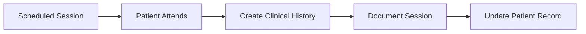

Session management in the Patient Manager application allows you to schedule, track, and organize therapy sessions for your patients. This guide covers everything you need to know about working with patient sessions.

## Overview

The session management system provides:

- Flexible session scheduling (up to 3 recurring sessions per patient)
- Multiple session modes (In-person and Virtual)
- Custom billing rates and currencies
- Day and time configuration
- Integration with patient records

<Info>
  Sessions are configured during patient registration but can be modified later. Each session is a recurring appointment for the specified day and time.
</Info>

## Session Data Model

Understanding the session structure helps you manage appointments effectively:

<CodeGroup>
```java Session Model
// From Session.java:22-53
@Entity
@Table(name = "patient_session")
public class Session {
    @Id
    @GeneratedValue(strategy = GenerationType.IDENTITY)
    private Long id;
    
    @ManyToOne
    @JoinColumn(name = "patient_id", nullable = false)
    private Patient patient;
    
    private DayOfWeek dayOfWeek;
    
    @Column(name = "start_time")
    private LocalTime from;
    
    @Column(name = "end_time")
    private LocalTime to;
    
    private String mode;  // "Presencial" or "Virtual"
    
    private String difBillingRate;
    
    private String currency;  // "Pesos", "Dolares", "Euros"
}
```
</CodeGroup>

### Session Components

<CardGroup cols={2}>
  <Card title="Timing" icon="clock">
    - Day of week (Monday-Saturday)
    - Start time (from)
    - End time (to)
    - Default duration: 1 hour
  </Card>
  
  <Card title="Details" icon="info-circle">
    - Patient association
    - Session mode
    - Billing information
    - Currency preference
  </Card>
</CardGroup>

## Scheduling Sessions

Sessions are typically scheduled during patient registration:

<Steps>
  <Step title="Access Session Configuration">
    When creating or editing a patient, navigate to the **Session Data** (Datos de sesión) section.
    
    You can configure up to 3 recurring sessions for each patient.
  </Step>

  <Step title="Configure First Session">
    For Session 1, select:
    
    **Day (Día)**:
    - Lunes (Monday)
    - Martes (Tuesday)
    - Miercoles (Wednesday)
    - Jueves (Thursday)
    - Viernes (Friday)
    - Sabado (Saturday)
    
    **Time (Horario)**:
    Available slots from 07:00 to 22:00 in 30-minute intervals:
    ```
    07:00, 07:30, 08:00, 08:30, ..., 21:30, 22:00
    ```
    
    **Mode (Modalidad)**:
    - Presencial (In-person)
    - Virtual (Online/Remote)
    
    <Warning>
      Both Day and Time must be selected (not "-") for the session to be created.
    </Warning>
  </Step>

  <Step title="Add Additional Sessions (Optional)">
    If the patient requires multiple weekly sessions, configure Session 2 and Session 3 using the same process.
    
    **Common scenarios**:
    - Twice weekly: Configure Session 1 and Session 2
    - Three times weekly: Configure all three sessions
    - Single weekly: Configure only Session 1
  </Step>

  <Step title="Set Billing Information">
    If this patient has special billing arrangements:
    
    - **Special Rate** (Tarifa dif.): Enter custom rate amount
    - **Currency**: Select from Pesos, Dolares, or Euros
    
    This information applies to all sessions for this patient.
  </Step>

  <Step title="Save Session Configuration">
    When you save the patient record, all configured sessions are automatically created and stored in the database.
    
    The session creation logic validates that both day and time are selected before creating each session.
  </Step>
</Steps>

## Session Creation Logic

Here's how sessions are processed when you save a patient:

<CodeGroup>
```java Session Validation and Creation
// From LoadPatientForm.java:710-731
if(cmbPatientSessionDay1.getSelectedIndex() != 0 
   && cmbPatientSessionHour1.getSelectedIndex() != 0){
   
   // Get selected day and convert to DayOfWeek
   String sessionDay1 = (String) cmbPatientSessionDay1.getSelectedItem();
   DayOfWeek castedSessionDay1 = DateMapper.mapDay(sessionDay1);
   
   // Get selected time and convert to LocalTime
   String sessionHour1 = (String) cmbPatientSessionHour1.getSelectedItem();
   LocalTime castedSessionHour1 = DateMapper.mapHour(sessionHour1);
   
   String sessionMode1 = (String) cmbPatientSessionMode1.getSelectedItem();
   
   // Create session with 1-hour duration
   Session newSession1 = new Session(
      newPatient,
      castedSessionDay1,
      castedSessionHour1,
      castedSessionHour1.plusHours(1),  // End time = start + 1 hour
      sessionMode1,
      difBillingRate,
      currency    
   );
   
   sessionService.create(newSession1);
}
```
</CodeGroup>

<Note>
  Sessions are only created if both the day and time dropdowns are set to valid values (index != 0, meaning not the default "-" option).
</Note>

## Viewing Patient Sessions

Patient sessions appear in multiple places throughout the application:

### In Patient List View

When viewing all patients, the **Sessions** column shows a formatted summary:

```
Lunes 10:00 - Virtual, Miercoles 14:30 - Presencial
```

This provides a quick overview of each patient's session schedule.

### In Patient Detail View

The patient profile displays complete session information:

<Tabs>
  <Tab title="Session 1">
    ```
    Lunes 10:00-11:00 (Presencial)
    ```
    
    Shows day, time range, and mode for the first session.
  </Tab>
  
  <Tab title="Session 2">
    ```
    Miercoles 14:30-15:30 (Virtual)
    ```
    
    Second session details if configured.
  </Tab>
  
  <Tab title="Session 3">
    ```
    Viernes 16:00-17:00 (Presencial)
    ```
    
    Third session details if configured.
  </Tab>
</Tabs>

Unused session slots display as "-".

## Session Modes Explained

<Accordion title="Presencial (In-Person Sessions)">
  **When to use**:
  - Patient attends at your office
  - In-person therapy is required
  - Patient prefers face-to-face interaction
  
  **Considerations**:
  - Office space availability
  - Travel time for patient
  - Accessibility requirements
  
  **Display**: Shows as "Presencial" in session listings
</Accordion>

<Accordion title="Virtual (Online Sessions)">
  **When to use**:
  - Remote therapy via video conferencing
  - Patient cannot attend in person
  - Teletherapy is appropriate for treatment
  
  **Considerations**:
  - Internet connectivity requirements
  - Platform/software needed
  - Privacy and confidentiality in remote setting
  
  **Display**: Shows as "Virtual" in session listings
</Accordion>

## Managing Multiple Sessions

Some patients require multiple sessions per week:

### Typical Multi-Session Scenarios

<CardGroup cols={3}>
  <Card title="Twice Weekly" icon="2">
    Common for:
    - Intensive therapy
    - Crisis intervention
    - Initial treatment phase
    
    Configure Session 1 and Session 2
  </Card>
  
  <Card title="Three Times Weekly" icon="3">
    Common for:
    - High-intensity treatment
    - Specialized programs
    - Short-term intensive work
    
    Configure all three sessions
  </Card>
  
  <Card title="Mixed Mode" icon="shuffle">
    Example:
    - Session 1: Monday 10:00 (Presencial)
    - Session 2: Thursday 15:00 (Virtual)
    
    Mix in-person and virtual as needed
  </Card>
</CardGroup>

## Time Slot Configuration

The application supports sessions from early morning to evening:

<Tabs>
  <Tab title="Morning Slots">
    ```
    07:00 - 12:00
    ```
    
    30-minute intervals:
    - 07:00, 07:30
    - 08:00, 08:30
    - 09:00, 09:30
    - 10:00, 10:30
    - 11:00, 11:30
    - 12:00
  </Tab>
  
  <Tab title="Afternoon Slots">
    ```
    12:00 - 18:00
    ```
    
    30-minute intervals:
    - 12:00, 12:30
    - 13:00, 13:30
    - 14:00, 14:30
    - 15:00, 15:30
    - 16:00, 16:30
    - 17:00, 17:30
    - 18:00
  </Tab>
  
  <Tab title="Evening Slots">
    ```
    18:00 - 22:00
    ```
    
    30-minute intervals:
    - 18:00, 18:30
    - 19:00, 19:30
    - 20:00, 20:30
    - 21:00, 21:30
    - 22:00
  </Tab>
</Tabs>

<Note>
  All sessions are automatically set to 1-hour duration. The end time is calculated as start time + 1 hour.
</Note>

## Billing and Currency

Session billing information is configured at the patient level:

### Currency Options

<Tabs>
  <Tab title="Pesos">
    Default currency for Argentina and other countries using pesos.
  </Tab>
  
  <Tab title="Dolares">
    US Dollars - for international patients or dollar-based pricing.
  </Tab>
  
  <Tab title="Euros">
    European currency - for European patients or euro-based pricing.
  </Tab>
</Tabs>

### Special Billing Rates

The **Special Rate** (Tarifa dif.) field allows you to:

- Set reduced rates for specific patients
- Configure sliding scale pricing
- Document insurance reimbursement rates
- Track scholarship or subsidized rates

<Tip>
  Use the observations field to note the reason for special billing rates (e.g., "Student rate", "Insurance coverage", "Financial hardship").
</Tip>

## Session Display Formatting

Sessions are formatted for display using the `ModelMapper` utility:

```java
// Sessions displayed in patient list
List<Session> sessions = sessionService.findByPatient(p.getPatientId());
String formattedSessions = ModelMapper.formatSessions(sessions);

// Sessions displayed in patient detail view
List<String> sessionLabels = ModelMapper.formatSessionsLabels(sessions);
```

This creates user-friendly session descriptions like:
- "Lunes 10:00 - Presencial"
- "Miercoles 14:30 - Virtual"

## Best Practices

<AccordionGroup>
  <Accordion title="Schedule Consistently">
    Try to maintain consistent session times each week:
    
    **Benefits**:
    - Patients can plan around fixed appointments
    - Easier to track attendance patterns
    - Reduces scheduling conflicts
    - Builds therapeutic routine
  </Accordion>
  
  <Accordion title="Consider Patient Availability">
    When scheduling:
    
    - Ask about work schedules
    - Consider school/childcare needs
    - Account for transportation time
    - Respect patient preferences
  </Accordion>
  
  <Accordion title="Plan for Virtual Capacity">
    For virtual sessions:
    
    - Ensure reliable video conferencing platform
    - Test patient's technical setup
    - Have backup communication method
    - Consider privacy concerns
  </Accordion>
  
  <Accordion title="Document Billing Clearly">
    Always document:
    
    - Standard rate vs. special rate
    - Reason for rate adjustments
    - Currency used
    - Payment terms
  </Accordion>
</AccordionGroup>

## Editing Sessions

To modify existing session schedules:

<Steps>
  <Step title="Locate Patient Record">
    Find the patient using **Ver Pacientes** (View Patients).
  </Step>

  <Step title="Access Edit Function">
    Click **Editar** (Edit) button in the patient list view.
  </Step>

  <Step title="Modify Session Data">
    Update the day, time, or mode for any configured session.
  </Step>

  <Step title="Save Changes">
    Save the patient record to update the session configuration.
  </Step>
</Steps>

<Warning>
  Modifying sessions affects the recurring schedule. Ensure the patient is aware of any changes to their appointment times.
</Warning>

## Troubleshooting

<AccordionGroup>
  <Accordion title="Session not appearing in patient list">
    **Possible causes**:
    - Day or time was left at "-" default value
    - Session validation failed during save
    - Database transaction did not complete
    
    **Solution**:
    1. Edit the patient record
    2. Verify both day and time are selected (not "-")
    3. Save again and check the patient list
  </Accordion>
  
  <Accordion title="Wrong session time displaying">
    **Possible causes**:
    - Time zone configuration issue
    - Incorrect time selected during setup
    
    **Solution**:
    - Edit patient record and verify selected time
    - Check that LocalTime is being correctly parsed
  </Accordion>
  
  <Accordion title="Cannot configure third session">
    **Check**:
    - First two sessions are properly configured
    - Session 3 dropdowns are enabled
    - Both day and time are selected for Session 3
    
    **Solution**: Ensure all fields are filled before saving.
  </Accordion>
</AccordionGroup>

## Integration with Clinical Histories

Sessions provide the framework for clinical documentation:



When a patient attends a scheduled session:
1. The session provides date/time context
2. A clinical history record is created for that session
3. Session notes and observations are documented
4. The cycle continues for each scheduled session

## Next Steps

<CardGroup cols={2}>
  <Card title="Clinical Histories" icon="file-medical" href="/guide/clinical-histories">
    Learn how to document what happens during sessions
  </Card>
  
  <Card title="Patient Management" icon="user" href="/guide/patient-management">
    Return to patient management overview
  </Card>
</CardGroup>