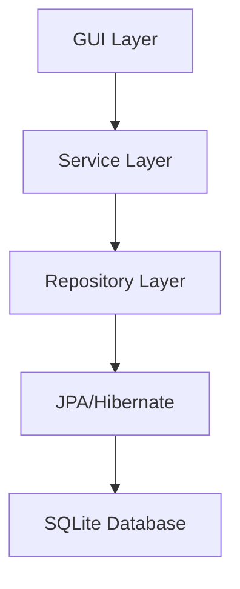

## What is Patient Manager?

Patient Manager is a Java-based desktop application designed for healthcare professionals to manage patient information, track therapy sessions, and maintain detailed clinical histories. Built with Swing for a modern, responsive interface, it provides a complete solution for patient care documentation and management.


## Key Features

<CardGroup cols={2}>
  <Card title="Patient Management" icon="users">
    Create, update, and organize patient profiles with comprehensive demographic and contact information
  </Card>
  <Card title="Clinical Histories" icon="file-medical">
    Document therapy sessions with detailed observations, conclusions, and file attachments
  </Card>
  <Card title="Session Scheduling" icon="calendar">
    Schedule recurring therapy sessions with flexible billing rates and session modes
  </Card>
  <Card title="Relative Tracking" icon="user-group">
    Track patient relatives and family connections with dedicated observation notes
  </Card>
</CardGroup>

## Core Capabilities

### Patient Records

Maintain complete patient profiles including:

- Personal information (name, birthday, gender, contact details)
- Address and location data (city, country)
- Multiple phone numbers and email addresses
- Social media contacts and referral sources
- Patient status tracking (Active, Discharged, Abandoned, Referred)
- Custom avatars for visual identification
- Detailed observations and notes

### Clinical History Management

Document every therapy session with:

- Unique clinical history codes for easy reference
- Session date and time tracking
- Comprehensive session content notes
- Clinical observations and conclusions
- Keyword tagging for searchable records
- File attachments for supporting documents
- Psychologist name attribution

### Session Organization

Schedule and track recurring therapy sessions:

- Weekly scheduling with specific days and times
- Session mode configuration (in-person, virtual, etc.)
- Differential billing rates per session
- Multi-currency support
- Patient-session associations

### Data Persistence

<Note>
  Patient Manager uses **SQLite** for local data storage, ensuring your patient data remains private and secure on your machine. The database is automatically created in your user directory at `~/.patientManager/patient.db`.
</Note>

## Technology Stack

Patient Manager is built with modern Java technologies:

<CodeGroup>
```xml pom.xml
<properties>
  <maven.compiler.source>19</maven.compiler.source>
  <maven.compiler.target>19</maven.compiler.target>
</properties>
```
</CodeGroup>

- **Java 19+** - Modern Java features and performance
- **Hibernate 6.4.4** - Object-relational mapping with JPA
- **SQLite** - Embedded database for local storage
- **Java Swing** - Desktop GUI framework
- **FlatLaf 3.4** - Modern look and feel with theme support
- **JCalendar 1.4** - Date picker components
- **Maven** - Project build and dependency management

## Architecture Overview

The application follows a layered architecture pattern:



### Layers

<Steps>
  <Step title="Presentation Layer">
    Swing-based GUI components in `com.bo.patientmanager.gui` package, including main window, patient forms, and data views
  </Step>
  
  <Step title="Service Layer">
    Business logic and transaction management via `ServiceManager` and specialized services for each entity
  </Step>
  
  <Step title="Repository Layer">
    Data access objects extending `BaseRepository` for CRUD operations on entities
  </Step>
  
  <Step title="Persistence Layer">
    JPA entities mapped to SQLite tables via Hibernate ORM
  </Step>
</Steps>

## Use Cases

Patient Manager is ideal for:

- **Private Practice Therapists** - Manage individual patient caseloads
- **Psychology Clinics** - Track multiple patients and sessions
- **Mental Health Professionals** - Document therapy sessions and progress
- **Healthcare Providers** - Maintain organized patient records

<Warning>
  This application is designed for local, single-user deployments. It does not include multi-user access controls or network synchronization features.
</Warning>

## Getting Started

Ready to begin? Follow these next steps:

<CardGroup cols={2}>
  <Card title="Installation" icon="download" href="/installation">
    Install Java 19+ and build the application
  </Card>
  <Card title="Quick Start" icon="rocket" href="/quickstart">
    Learn the basics and create your first patient
  </Card>
</CardGroup>

## Support

For issues, feature requests, or contributions, visit the [GitHub repository](https://github.com/Br1-O/RM-patientManagerApp).