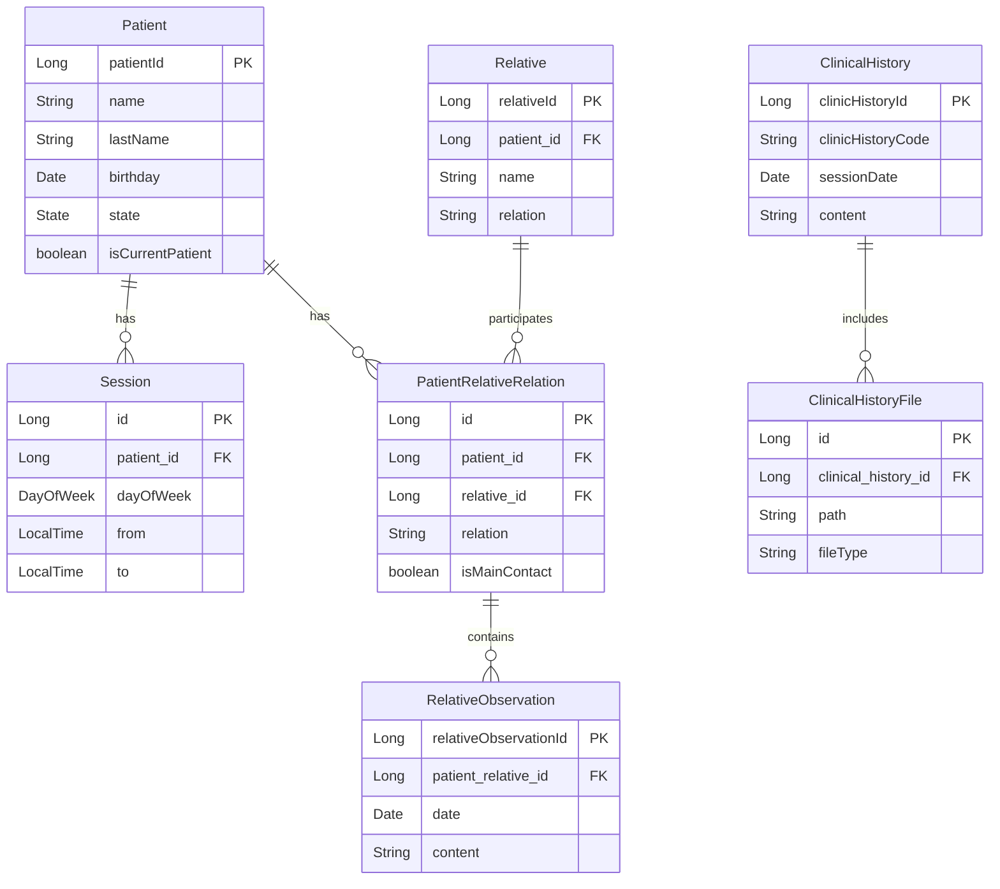

## Introduction

The Patient Manager application uses a relational database model built with Jakarta Persistence (JPA) to manage patient information, clinical histories, therapy sessions, and family relationships.

## Core Entities

The data model consists of seven primary entities:

<CardGroup cols={2}>
  <Card title="Patient" icon="user" href="/model/patient">
    Core entity representing a patient with personal information and treatment status
  </Card>
  <Card title="Clinical History" icon="file-medical" href="/model/clinical-history">
    Records of therapy sessions with notes, observations, and attachments
  </Card>
  <Card title="Session" icon="calendar" href="/model/session">
    Scheduled recurring therapy sessions for patients
  </Card>
  <Card title="Relative" icon="users" href="/model/relative">
    Family members and contacts associated with patients
  </Card>
</CardGroup>

## Entity Relationships



## Relationship Types

### One-to-Many Relationships

<AccordionGroup>
  <Accordion title="Patient → Session">
    Each patient can have multiple scheduled therapy sessions. Sessions store recurring appointment times.
    
    ```java
    @ManyToOne
    @JoinColumn(name = "patient_id", nullable = false)
    private Patient patient;
    ```
  </Accordion>

  <Accordion title="Patient → Relative">
    Each patient can have multiple family members or contacts associated with them.
    
    ```java
    @ManyToOne
    @JoinColumn(name = "patient_id", nullable = false)
    private Patient patient;
    ```
  </Accordion>

  <Accordion title="ClinicalHistory → ClinicalHistoryFile">
    Each clinical history record can have multiple file attachments.
    
    ```java
    @OneToMany(mappedBy = "clinicalHistory")
    private List<ClinicalHistoryFile> files;
    ```
  </Accordion>

  <Accordion title="PatientRelativeRelation → RelativeObservation">
    Each patient-relative relationship can have multiple timestamped observations.
    
    ```java
    @OneToMany(mappedBy = "patientRelativeRelation")
    private List<RelativeObservation> observations;
    ```
  </Accordion>
</AccordionGroup>

### Many-to-Many Through Join Table

The relationship between patients and relatives is modeled through the **PatientRelativeRelation** entity, which acts as a join table and includes additional attributes:
- Relationship type (parent, sibling, spouse, etc.)
- Whether the relative is the main contact
- Associated observations about the relationship

## Database Schema

### Table Names

Most entities use their class name as the table name, with these exceptions:
- `Session` → `patient_session` (explicitly defined)

### Primary Keys

All entities use auto-generated Long identifiers:
```java
@Id
@GeneratedValue(strategy = GenerationType.IDENTITY)
private Long id;
```

### Large Text Fields

Several entities contain large text fields defined with `@Column(length = 4000)`:
- Patient observations
- Clinical history content, observations, and conclusions
- Relative observation content

These fields support storing extensive clinical notes and documentation.

## Key Design Patterns

<CardGroup cols={2}>
  <Card title="Soft Deletes" icon="trash-can">
    Patients use a state system (ACTIVO, ALTA, ABANDONO, DERIVACION) rather than hard deletion
  </Card>
  <Card title="Composite Information" icon="id-card">
    Personal information is denormalized within entities for query efficiency
  </Card>
  <Card title="Audit Fields" icon="clock">
    Timestamps and metadata track when records are created (sessionDate, date fields)
  </Card>
  <Card title="Flexible Text Storage" icon="text">
    Large text fields accommodate unstructured clinical notes
  </Card>
</CardGroup>

## Data Integrity

### Required Relationships

Several foreign key relationships are marked as non-nullable:
- Session must reference a Patient
- Relative must reference a Patient
- ClinicalHistoryFile must reference a ClinicalHistory
- RelativeObservation must reference a PatientRelativeRelation

### Default Values

New patients are automatically assigned:
```java
this.isCurrentPatient = true;
this.state = State.ACTIVO;
```

## Next Steps

<CardGroup cols={2}>
  <Card title="Patient Entity" icon="user" href="/model/patient">
    Learn about patient fields, states, and management
  </Card>
  <Card title="Clinical History" icon="file-medical" href="/model/clinical-history">
    Understand session documentation and file attachments
  </Card>
  <Card title="Sessions" icon="calendar" href="/model/session">
    Configure recurring therapy appointments
  </Card>
  <Card title="Relatives" icon="users" href="/model/relative">
    Manage patient contacts and family relationships
  </Card>
</CardGroup>