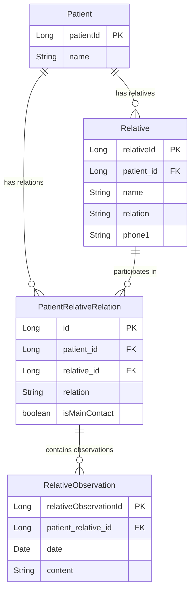

## Overview

The relative management system uses three interconnected entities to track patient family members, their relationships, and observations about those relationships:

- **Relative** - Personal information about a family member or contact
- **PatientRelativeRelation** - The relationship between a patient and relative
- **RelativeObservation** - Notes and observations about the relationship over time

## Relative Entity

The `Relative` entity stores personal and contact information for family members and emergency contacts.

**Source:** `src/main/java/com/bo/patientmanager/model/Relative.java`

### Entity Definition

```java
@Entity
public class Relative {
    @Id
    @GeneratedValue(strategy = GenerationType.IDENTITY)
    private Long relativeId;
    
    @ManyToOne
    @JoinColumn(name = "patient_id", nullable = false)
    private Patient patient;
    
    private String name;
    private String lastName;
    private String relation;
    private Date birthday;
    private String gender;
    private String avatar;
    private String address;
    private String city;
    private String country;
    private String phone1;
    private String phone2;
    private String email;
}
```

### Fields

<ParamField path="relativeId" type="Long" required>
  Primary key, auto-generated database identifier
</ParamField>

<ParamField path="patient" type="Patient" required>
  Reference to the associated patient
  
  **Relationship:** Many-to-One (required, non-nullable)
  
  Each relative must be associated with at least one patient.
  
  ```java
  @ManyToOne
  @JoinColumn(name = "patient_id", nullable = false)
  private Patient patient;
  ```
</ParamField>

<ParamField path="name" type="String">
  Relative's first name
</ParamField>

<ParamField path="lastName" type="String">
  Relative's last name or surname
</ParamField>

<ParamField path="relation" type="String">
  Type of relationship to the patient
  
  **Examples:** "Mother", "Father", "Spouse", "Sibling", "Child", "Guardian", "Emergency Contact"
</ParamField>

<ParamField path="birthday" type="Date">
  Relative's date of birth
</ParamField>

<ParamField path="gender" type="String">
  Relative's gender
</ParamField>

<ParamField path="avatar" type="String">
  Path or URL to relative's profile image
</ParamField>

<ParamField path="address" type="String">
  Relative's street address
</ParamField>

<ParamField path="city" type="String">
  Relative's city of residence
</ParamField>

<ParamField path="country" type="String">
  Relative's country of residence
</ParamField>

<ParamField path="phone1" type="String">
  Primary contact phone number
</ParamField>

<ParamField path="phone2" type="String">
  Secondary contact phone number
</ParamField>

<ParamField path="email" type="String">
  Relative's email address
</ParamField>

## PatientRelativeRelation Entity

The `PatientRelativeRelation` entity acts as a join table that manages the many-to-many relationship between patients and relatives. It includes additional information about the specific relationship.

**Source:** `src/main/java/com/bo/patientmanager/model/PatientRelativeRelation.java`

### Entity Definition

```java
@Entity
public class PatientRelativeRelation {
    @Id
    @GeneratedValue(strategy = GenerationType.IDENTITY)
    private Long id;
    
    @ManyToOne
    private Patient patient;
    
    @ManyToOne
    private Relative relative;
    
    private String relation;
    
    @OneToMany(mappedBy = "patientRelativeRelation")
    private List<RelativeObservation> observations;
    
    private boolean isMainContact;
}
```

### Fields

<ParamField path="id" type="Long" required>
  Primary key for the relationship record
</ParamField>

<ParamField path="patient" type="Patient" required>
  Reference to the patient
  
  **Relationship:** Many-to-One
</ParamField>

<ParamField path="relative" type="Relative" required>
  Reference to the relative
  
  **Relationship:** Many-to-One
</ParamField>

<ParamField path="relation" type="String">
  Describes the specific relationship type
  
  **Examples:** "Mother", "Father", "Spouse", "Sister", "Brother", "Child", "Grandmother", "Legal Guardian"
  
  <Note>
    This field may duplicate the `relation` field in the Relative entity, but allows for relationship-specific context (e.g., a relative could be "Mother" to one patient and "Grandmother" to another).
  </Note>
</ParamField>

<ParamField path="observations" type="List<RelativeObservation>">
  Collection of observations about this specific relationship
  
  **Relationship:** One-to-Many with RelativeObservation
  
  See [RelativeObservation](#relativeobservation-entity) for details.
</ParamField>

<ParamField path="isMainContact" type="boolean" default="false">
  Indicates if this relative is the primary emergency contact
  
  Used to identify the main point of contact for patient care coordination.
</ParamField>

### toString Method

The entity provides a convenient string representation:

```java
@Override
public String toString() {
    return relative.getName() + " " + relative.getLastName() + " - " + relative.getRelation();
}
```

**Example output:** "María González - Mother"

## RelativeObservation Entity

The `RelativeObservation` entity stores timestamped notes about a patient-relative relationship.

**Source:** `src/main/java/com/bo/patientmanager/model/RelativeObservation.java`

### Entity Definition

```java
@Entity
public class RelativeObservation {
    @Id
    @GeneratedValue(strategy = GenerationType.IDENTITY)
    private Long relativeObservationId;
    
    @ManyToOne
    @JoinColumn(name = "patient_relative_id", nullable = false)
    private PatientRelativeRelation patientRelativeRelation;
    
    private Date date;
    
    @Column(length = 4000)
    private String content;
}
```

### Fields

<ParamField path="relativeObservationId" type="Long" required>
  Primary key for the observation
</ParamField>

<ParamField path="patientRelativeRelation" type="PatientRelativeRelation" required>
  Reference to the patient-relative relationship
  
  **Relationship:** Many-to-One (required, non-nullable)
  
  ```java
  @ManyToOne
  @JoinColumn(name = "patient_relative_id", nullable = false)
  private PatientRelativeRelation patientRelativeRelation;
  ```
</ParamField>

<ParamField path="date" type="Date">
  Date when the observation was recorded
</ParamField>

<ParamField path="content" type="String">
  The observation text
  
  **Database:** `@Column(length = 4000)`
  
  Large text field for detailed notes about family dynamics, interactions, or significant events.
</ParamField>

### toString Method

```java
@Override
public String toString() {
    return date + " - " + content;
}
```

**Example output:** "2024-03-15 - Mother expressed concern about patient's medication side effects"

## Entity Relationships



## Usage Examples

### Creating a Relative

```java
Relative mother = new Relative(
    patient,                        // patient
    "María",                        // name
    "González",                     // lastName
    "Mother",                       // relation
    new Date(1970, 5, 15),         // birthday
    "Female",                       // gender
    "/avatars/maria.jpg",          // avatar
    "Calle Flores 456",            // address
    "Buenos Aires",                // city
    "Argentina",                    // country
    "+54 11 9876-5432",            // phone1
    null,                           // phone2
    "maria.gonzalez@example.com"   // email
);
```

### Creating a Patient-Relative Relationship

```java
PatientRelativeRelation relation = new PatientRelativeRelation(
    patient,                        // patient
    mother,                         // relative
    "Mother",                       // relation
    new ArrayList<>(),              // observations (empty initially)
    true                            // isMainContact
);
```

### Adding Observations

```java
RelativeObservation observation = new RelativeObservation(
    relation,                       // patientRelativeRelation
    new Date(),                     // date
    "Mother attended session today. Expressed concern about " +
    "patient's sleep patterns. Very supportive and engaged. " +
    "Agreed to help with homework assignments."
);

relation.getObservations().add(observation);
```

### Finding Main Contact

```java
public Optional<PatientRelativeRelation> getMainContact(Patient patient) {
    return patientRelativeRelationRepository
        .findByPatientAndIsMainContact(patient, true)
        .stream()
        .findFirst();
}
```

### Getting All Patient Relatives

```java
public List<Relative> getPatientRelatives(Patient patient) {
    return relativeRepository.findByPatient(patient);
}

// Or through the relation entity
public List<PatientRelativeRelation> getPatientRelations(Patient patient) {
    return patientRelativeRelationRepository
        .findByPatient(patient);
}
```

### Timeline of Observations

```java
public List<RelativeObservation> getObservationTimeline(PatientRelativeRelation relation) {
    return relativeObservationRepository
        .findByPatientRelativeRelation(relation)
        .stream()
        .sorted(Comparator.comparing(RelativeObservation::getDate).reversed())
        .collect(Collectors.toList());
}
```

## Use Cases

<AccordionGroup>
  <Accordion title="Emergency Contact Management">
    Track primary and secondary emergency contacts with full contact details.
    
    ```java
    // Set mother as main contact
    motherRelation.setIsMainContact(true);
    
    // Update other contacts to not be main
    otherRelations.forEach(r -> r.setIsMainContact(false));
    ```
  </Accordion>

  <Accordion title="Family Therapy Documentation">
    Document family dynamics and interactions observed during therapy.
    
    ```java
    RelativeObservation obs = new RelativeObservation(
        relation,
        new Date(),
        "Family session: Mother and patient working through " +
        "communication issues. Good progress noted."
    );
    ```
  </Accordion>

  <Accordion title="Child/Minor Patient Support">
    Track parents and legal guardians for minor patients.
    
    ```java
    // Create guardian relationships
    PatientRelativeRelation fatherRelation = new PatientRelativeRelation(
        childPatient, father, "Father - Legal Guardian", 
        new ArrayList<>(), true
    );
    ```
  </Accordion>

  <Accordion title="Multi-Patient Families">
    A single relative can be associated with multiple patients (e.g., siblings in therapy).
    
    ```java
    // Same mother for two sibling patients
    Relative mother = createRelative(...);
    
    PatientRelativeRelation relation1 = new PatientRelativeRelation(
        siblingPatient1, mother, "Mother", new ArrayList<>(), true
    );
    
    PatientRelativeRelation relation2 = new PatientRelativeRelation(
        siblingPatient2, mother, "Mother", new ArrayList<>(), true
    );
    ```
  </Accordion>
</AccordionGroup>

## Design Considerations

### Why Three Entities?

This design pattern provides flexibility:

<Steps>
  <Step title="Relative Entity">
    Stores personal information once, avoiding duplication
  </Step>
  <Step title="PatientRelativeRelation Entity">
    Allows one relative to be connected to multiple patients with different relationship contexts
  </Step>
  <Step title="RelativeObservation Entity">
    Tracks the evolution of relationships over time with timestamped notes
  </Step>
</Steps>

### Data Duplication

<Info>
  Both `Relative` and `PatientRelativeRelation` have a `relation` field:
  
  - **Relative.relation**: General relationship type (stored with the relative record)
  - **PatientRelativeRelation.relation**: Specific relationship context for this patient
  
  This allows flexibility when a relative has different relationships to different patients.
</Info>

## Best Practices

<CardGroup cols={2}>
  <Card title="Single Main Contact" icon="star">
    Ensure only one relative per patient has isMainContact = true
  </Card>
  <Card title="Contact Information" icon="phone">
    Always collect at least one phone number for emergency contacts
  </Card>
  <Card title="Observation Dates" icon="calendar">
    Always set the date when creating observations for accurate timeline
  </Card>
  <Card title="Relationship Labels" icon="tag">
    Use consistent relationship labels across the system
  </Card>
</CardGroup>

## Common Relationship Types

| Relationship | Description | Typical Use |
|-------------|-------------|-------------|
| Mother | Biological or adoptive mother | Family therapy, child patients |
| Father | Biological or adoptive father | Family therapy, child patients |
| Spouse | Married partner | Couples therapy, support |
| Partner | Non-married partner | Couples therapy, support |
| Sibling | Brother or sister | Family dynamics |
| Child | Son or daughter | Parent therapy context |
| Guardian | Legal guardian | Minor patient care |
| Emergency Contact | Non-family emergency contact | Safety planning |
| Grandparent | Grandmother or grandfather | Extended family therapy |

## Data Validation

<Warning>
  Implement these validations:
  
  - At least one phone number (phone1 or phone2) for main contacts
  - Valid email format if email is provided
  - Patient and Relative must exist before creating PatientRelativeRelation
  - Observation content should not exceed 4000 characters
  - Only one main contact per patient
</Warning>

## Related Documentation

<CardGroup cols={2}>
  <Card title="Patient Entity" icon="user" href="/model/patient">
    Learn about the patient entity
  </Card>
  <Card title="Clinical History" icon="file-medical" href="/model/clinical-history">
    Document therapy sessions
  </Card>
  <Card title="Data Model Overview" icon="diagram-project" href="/model/overview">
    View complete entity relationships
  </Card>
</CardGroup>